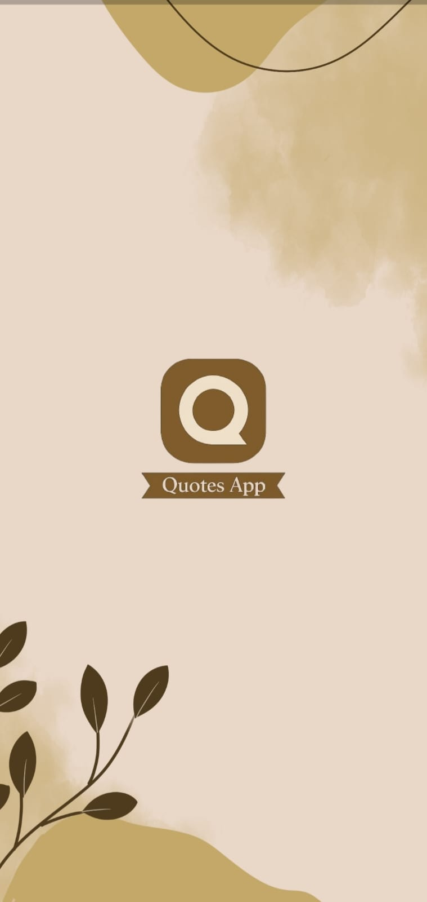
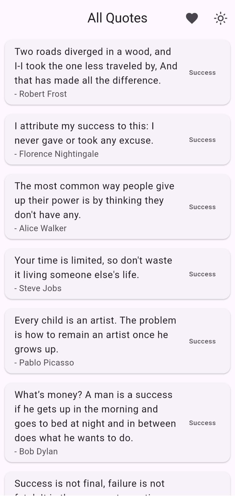
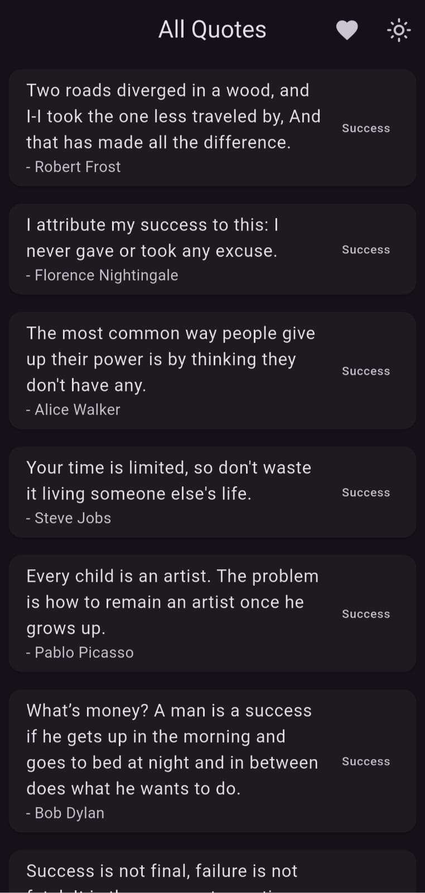
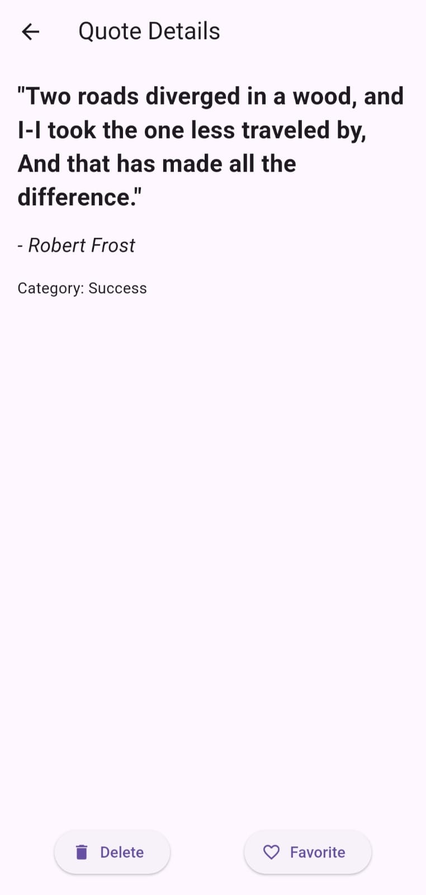
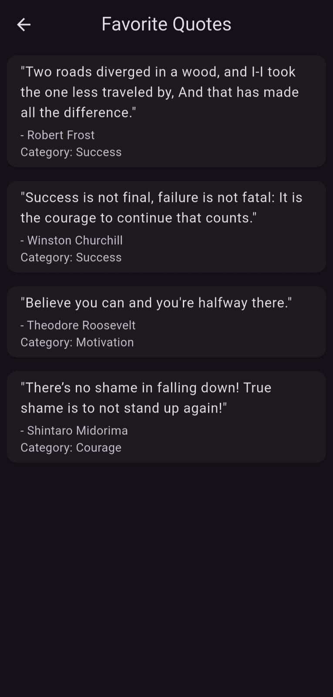

✨ QUOTELY

Quotely is a beautifully designed Flutter application that offers a collection of motivational, inspirational, and thoughtful quotes. With support for categories, favorites, SQLite storage, and theme switching, the app provides a smooth and customizable experience for quote lovers.

🚀 Features
📚 Category-Wise Quote Listing
Browse quotes by categories like Motivation, Love, Success, and more.

⭐ Favorite Quotes
Mark quotes you love and view them anytime in a dedicated screen.

📝 Add Your Own Quotes
Manually add personalized quotes with author and category.

💾 Local Storage with SQLite
All quotes and favorites are stored locally using SQLite.

🌙 Light & Dark Mode
Seamless theme toggle for user comfort.

📱 Smooth Navigation with GetX
Fast, reactive routing and state management using GetX.

📸 Screenshots

	

	

	

	

🛠 Tech Stack
Flutter - UI development

Dart - Language

SQLite - Local database

GetX - State management and navigation

Local JSON - Initial quotes loading

🔧 Installation
Clone the repository

bash
Copy
Edit
git clone https://github.com/Vishakha1510/quotely.git
cd quotely
Install dependencies

bash
Copy
Edit
flutter pub get
Run the app

bash
Copy
Edit
flutter run
🎨 UI Previews
Light Theme	Dark Theme

🌐 API Integration for dynamic quotes

📤 Quote sharing with image templates

🤝 Contributing
Contributions, suggestions, and feature requests are welcome!
Feel free to open an issue or submit a pull request. 💬

📜 License
This project is licensed under the MIT License.

🌟 Show Your Support
If you like this project, don’t forget to ⭐️ the repo and share it with fellow quote enthusiasts!
